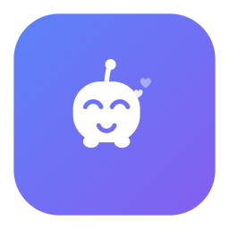
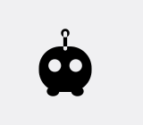
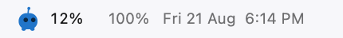
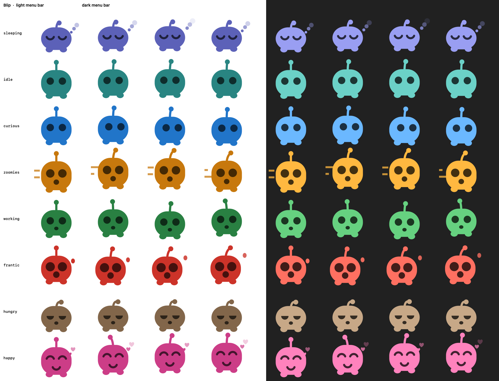

<div align="center">



# Blip

**A small creature who lives in your menu bar and reacts to what your Mac is doing.**

<picture>
  <source media="(prefers-color-scheme: dark)" srcset="docs/blip-dark.gif">
  
</picture>

No window. No Dock icon. No permissions. One file of drawing code.

</div>

---

He sits between your other status items and quietly mirrors the machine —
sleeping when you step away, panicking when something pegs the CPU, getting the
zoomies when you type fast. He takes the colour of whatever he's currently
feeling, and carries a live CPU percentage beside him so he earns his spot in
the bar.

<picture>
  <source media="(prefers-color-scheme: dark)" srcset="docs/menubar-dark.png">
  
</picture>

## Install

```bash
git clone https://github.com/PruthvinBatham/Blip.git
cd Blip
./build.sh && open build/Blip.app
```

Requires macOS 14+ and the Xcode Command Line Tools. No Xcode project, no
package manager, no dependencies — `build.sh` compiles the sources, assembles
the `.app`, generates the icon from the same drawing code the pet uses, and
ad-hoc signs it.

To keep him, drag `build/Blip.app` into `/Applications` and turn on **Open at
Login** from his menu. `SMAppService` generally wants the app there before it
will register.

## Moods

Eight of them. The first rule that matches wins:

| | Mood | Trigger |
|---|---|---|
| 💤 | `sleeping` | no input for 5 minutes |
| 🫧 | `idle` | nothing in particular |
| 👀 | `curious` | you touched the keyboard or mouse in the last 8s |
| ⌨️ | `zoomies` | you're typing fast — keys landing under 0.35s apart |
| 🔨 | `working` | CPU over 30% |
| 🔥 | `frantic` | CPU over 75% |
| 🪫 | `hungry` | battery under 20% and unplugged |
| 💛 | `happy` | you petted him in the last 4 seconds |

Click him for the live reading, his age, and how many times you've petted him.
His menu also carries **Show CPU %** and **Colorful**, both on by default —
turning colour off puts him back to the system-tinted template silhouette.



## How it works

| File | What's in it |
|---|---|
| [`Vitals.swift`](Sources/Vitals.swift) | everything he reacts to |
| [`Mood.swift`](Sources/Mood.swift) | the priority table above |
| [`Palette.swift`](Sources/Palette.swift) | one hue per mood, in a light-bar and a dark-bar variant |
| [`PetRenderer.swift`](Sources/PetRenderer.swift) | the entire character, in Core Graphics |
| [`AppDelegate.swift`](Sources/AppDelegate.swift) | status item, CPU readout, menu, frame cache |

He asks for **no permissions at all**, which was a design constraint rather than
an accident. CPU comes from `host_processor_info` tick deltas, idle time from
`CGEventSource.secondsSinceLastEventType`, battery from
`IOPSCopyPowerSourcesInfo`. Nothing here needs Accessibility or Input
Monitoring, so there's no consent dialog on first launch.

He's drawn as **one silhouette with the face taken out of it**, and the only
difference between his two looks is what happens to that face. In colour it's
painted back on in a deeper shade of the mood, so it doesn't depend on what is
behind him. With **Colorful** off it's *carved* out instead and the whole thing
ships as a template image — which is why the system tints him correctly on a
light bar, a dark bar, and the translucent one over your wallpaper, with no
appearance-change handling anywhere in the code.

Colour costs him that trick, so he has to know which bar he's in: he reads the
appearance off his own status item's button rather than the app's, because the
menu bar can be dark while the rest of the system is light.

### Three things that were easy to get wrong

<details>
<summary><b>Fill rules — why the antenna came out as a ring</b></summary>

<br>

The body, feet and antenna overlap each other. A single even-odd fill turns
every one of those overlaps into a hole: the antenna's ball, sitting on the end
of its stalk, becomes a ring, and the feet get white bites taken out of them.

Switching to the **winding** rule fixes the feet, which are wound the same way
as the body — but not the ball, and that is the part that took two goes to get
right. The stalk is a *stroked* path, and where the stroke's outline runs
against the ball's contour the two windings cancel and the ring comes straight
back. So the silhouette is filled as **three separate opaque passes** —
body-and-feet, stalk, ball. Subpaths of one path can cancel each other out;
three fills can't.

The face is then taken out separately: painted on in colour, or carved with
`destinationOut` in template mode — the carve inside a transparency layer,
because otherwise it punches through whatever was already on the context
underneath him.

</details>

<details>
<summary><b>Eyelids — why he briefly had horns</b></summary>

<br>

A half-closed eye is built as a **circular segment**: the arc below the lid
line, closed by its chord.

The obvious alternative is to subtract a lid rectangle from the eye circle. That
also subtracts the part of the rectangle hanging *outside* the eye, which carves
a slot straight through the rest of the head. The `hungry` mood spent one build
looking genuinely demonic.

The segment then has to be swept the **long** way round, under the lid line.
Sweep it the short way and the whole control inverts: a 90%-open eye becomes a
sliver at the top of the socket, `hungry` goes back to wearing two flat bars,
and every blink *swells* into a full circle instead of closing.

</details>

<details>
<summary><b>The 4-second loop — why he's cheap to run</b></summary>

<br>

Every animation is an integer harmonic of `PetRenderer.loopPeriod`, so the whole
character repeats **exactly** every 4 seconds. That lets `AppDelegate` render one
cycle of frames per mood and then reuse them forever, instead of drawing
something new 3–12 times a second, all day.

| | CPU | RSS |
|---|---|---|
| before caching | 3.0% of one core | 62 MB, churning |
| after | **1.0% of one core** | **42 MB, flat** |

*(Measured as CPU-seconds over 20-second windows. `ps %cpu` reports a lifetime
average and reads high on a freshly launched process.)*

Colour didn't cost anything here — the cache keys on the palette as well as the
mood and frame, and only one palette is ever live at a time.

Frame rate is per-mood as well — 12fps while frantic, 1.5fps asleep. If you add
a mood, keep its frequencies as `w * <integer>` or you'll reintroduce the churn,
plus a visible hitch every time the loop wraps.

</details>

## Dev tools

The renderer runs headless, so the art can be reviewed without squinting at an
18-point icon:

```bash
Blip --sheet    out.png  [mono]  # every mood, 9x, light and dark
Blip --pixels   out.png  [mono]  # true retina size, nearest-neighbour
Blip --gif      out.gif  [dark]  # animated mood cycle
Blip --menubar  out.png  [dark]  # mock menu bar at true size
Blip --iconset  dir/             # .iconset ready for iconutil
```

`mono` reviews the template silhouette instead of the mood colours.

`--pixels` is the honest one. The contact sheet is vector-scaled and flatters
the art; the menu bar renders him about 40 pixels tall.

## License

MIT — see [LICENSE](LICENSE).
